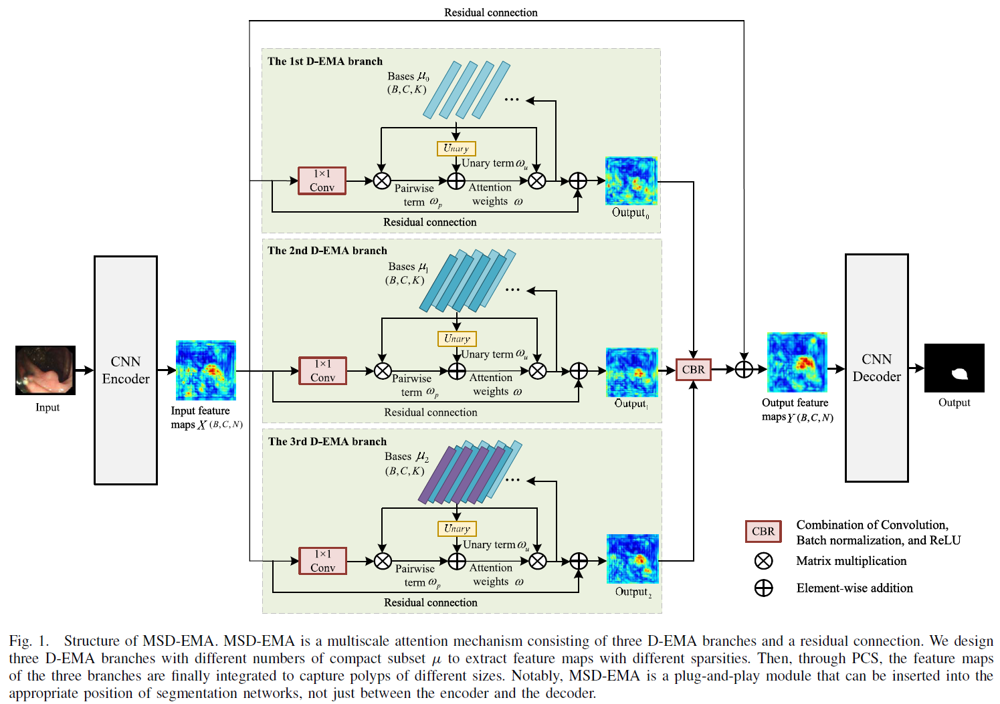
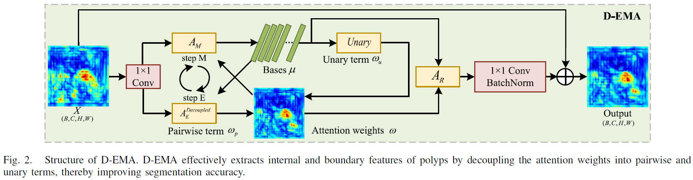
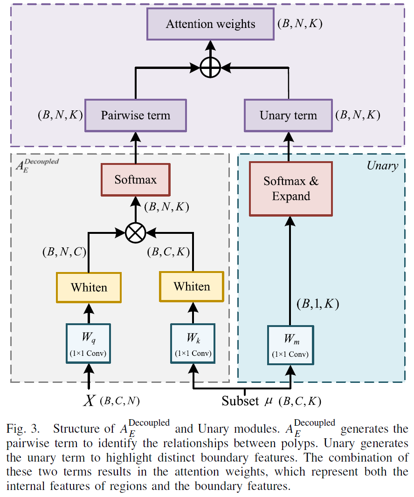

# MSD-EMA: Multiscale Decoupled Expectation–Maximization Attention for Polyp Segmentation

> X. Du, Y. Zou, T. Lei, D. Gu, X. Zhang and A. K. Nandi, "MSD-EMA: Multiscale Decoupled Expectation–Maximization Attention for Polyp Segmentation," in *IEEE Transactions on Instrumentation and Measurement*, vol. 74, pp. 1-13, 2025, Art no. 5013113, doi: 10.1109/TIM.2025.3547131.

## News

Congratulations! This work has been accepted by *IEEE Transactions on Instrumentation and Measurement*. The full version of this paper, including detailed information and data, can be accessed at [MSD-EMA](https://ieeexplore.ieee.org/document/10908956).

## Core idea

### Abstract

Automatic polyp segmentation is a crucial technique of computer-aided clinical diagnosis. However, some current polyp segmentation methods cannot accurately extract polyps from colonoscopy images due to the diversity of polyp shapes and sizes, as well as the blurry boundaries caused by the adhesion between polyps and surrounding tissues. To address this issue, we propose a multiscale decoupled expectation-maximization (EM) attention, namely MSD-EMA. There are two advantages of MSD-EMA. First, we design the decoupled EM attention, which decouples attention weights into the sum of pairwise term representing interregional features and unary term representing salient boundary features, thereby extracting boundary features between polyps and surrounding tissues while reducing computational complexity. Second, we propose the parallel collaborative strategy (PCS), which enables MSD-EMA to simultaneously extract sparse and dense feature maps using lower computational complexity. Sparse features are suitable for segmenting small polyps due to filtering out noise interference. Dense features are suitable for capturing large polyps that contain more location information. Comparative experiments are conducted with currently excellent polyp segmentation networks on five publicly available datasets, and the experimental results demonstrate that MSD-EMA can effectively improve polyp segmentation performance. Moreover, MSD-EMA is a plug-and-play module that can be applied to other types of segmentation tasks. The source code is available at https://github.com/EmarkZOU/MSD-EMA.

### Figures








## Citation

```
@article{DU2025129287,
title = {CCL-MPC: Semi-supervised medical image segmentation via collaborative intra-inter contrastive learning and multi-perspective consistency},
journal = {Neurocomputing},
volume = {621},
pages = {129287},
year = {2025},
issn = {0925-2312},
doi = {https://doi.org/10.1016/j.neucom.2024.129287},
url = {https://www.sciencedirect.com/science/article/pii/S0925231224020587},
author = {Xiaogang Du and Yibin Zou and Tao Lei and Weichuan Zhang and Yingbo Wang and Asoke K. Nandi},
keywords = {Deep learning, Medical image segmentation, Consistency regularization, Contrastive learning},
}
```


## Acknowledgements

[Expectation-Maximization Attention Networks](https://openaccess.thecvf.com/content_ICCV_2019/html/Li_Expectation-Maximization_Attention_Networks_for_Semantic_Segmentation_ICCV_2019_paper.html)

